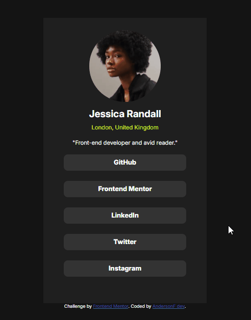

# Frontend Mentor - Social links profile

Esta é uma solução para o [Desafio da página de receitas no Frontend Mentor](https://www.frontendmentor.io/challenges/recipe-page-KiTsR8QQKm). Os desafios do Frontend Mentor ajudam você a melhorar suas habilidades de codificação construindo projetos realistas.

## Visão geral

### Screenshot

[]


### Link


- URL do site ativo: [link aqui](https://andersonf-dev.github.io/recipe-page-main/)


### Criado com

- Marcação HTML5 semântica
- Propriedades personalizadas CSS
- Flexbox


### O que aprendi

Aprendi a criar uma página responsiva, posicionar elementos na tela centralizar


```css
@media (max-width: 700px) {
    .recipe-conteiner {
        max-width: 320px;
    }

}
```

### Desenvolvimento contínuo

Este é apenas o segundo de muitos dos projetos de front end que fiz continuarei fazendo e mi desenvolvemdo ainda mais.
